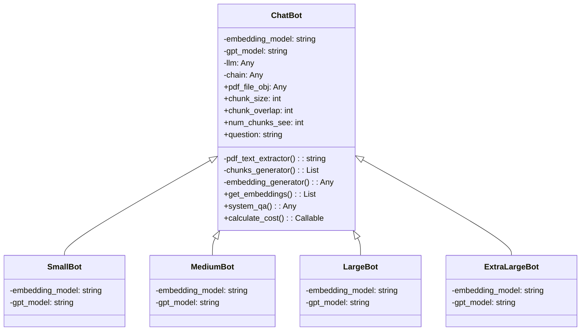

# ChatPDF
This project performs Natural Language Processing (NLP) tasks as a question/answer system for a PDF file by implementing the Object Oriented Programming paradigm, Embedding and the OpenAi API.

It uses the Streamlit library for the user interface, LangChain for language processing, and the OpenAI API to interact with ChatGPT.

# Installation

To install the necessary dependencies for this project, you can use pip:

```bash
pip install -r requirements.txt
```

# Usage
To start the Streamlit application, run the following command in your terminal:

```bash
streamlit run app.py
```
# Code Structure
The code is organized using Object-Oriented Programming (OOP) principles. Here is an overview of the main classes:

* ChatBot: A Superclass to represent a ChatBot that use a GPT model and a QA chain to answer questions based on a PDF document.
* SmallBot: A subclass of the ChatBot class that uses specific models for embeddings and GPT.
* MediumBot: A subclass of the ChatBot class that uses specific models for embeddings and GPT.
* LargeBot: A subclass of the ChatBot class that uses specific models for embeddings and GPT.
* ExtraLargeBot: A subclass of the ChatBot class that uses specific models for embeddings and GPT.

## UML diagram



# Contribution
Contributions to this project are welcome. Please open an issue to discuss your ideas before making a pull request.

# License
This project is licensed under the MIT license.